# React Component Library

A React component library built with TypeScript, Vite, and Storybook. Contains three reusable UI components with different states and props.

## Features

- Input Component - smart input with password visibility toggle and clear functionality
- Toast Component - notification component with auto-dismiss and transitions
- Sidebar Menu Component - menu with nested submenus and slide animation

## Installation

```bash
npm install
```

## Development

### Run Storybook

```bash
npm run storybook
```

Storybook will start on `http://localhost:6006`

### Build Storybook

```bash
npm run build-storybook
```

### Run Development Server

```bash
npm run dev
```

### Build Project

```bash
npm run build
```

### Linting

```bash
npm run lint
```

### Format Code

```bash
npm run format
```

## Project Structure

```
src/
├── components/
│   ├── Input/
│   │   ├── Input.tsx
│   │   ├── Input.module.css
│   │   └── index.ts
│   ├── Toast/
│   │   ├── Toast.tsx
│   │   ├── Toast.module.css
│   │   ├── ToastContainer.tsx
│   │   ├── ToastContainer.module.css
│   │   └── index.ts
│   └── SidebarMenu/
│       ├── SidebarMenu.tsx
│       ├── SidebarMenu.module.css
│       └── index.ts
├── stories/
│   ├── Input/
│   │   └── Input.stories.tsx
│   ├── Toast/
│   │   └── Toast.stories.tsx
│   └── SidebarMenu/
│       └── SidebarMenu.stories.tsx
└── index.ts
```

## Components

### Input Component

Smart input component with password visibility toggle and clear field functionality.

Features:
- Multiple input types support (text, password, number, email, tel, url)
- Password visibility toggle (eye icon)
- Clear button (X button)
- Controlled and uncontrolled modes support
- Accessibility support

Usage:

```tsx
import { Input } from './components/Input'

// Basic usage
<Input type="text" placeholder="Enter text..." />

// With clear button
<Input type="text" placeholder="Enter text..." clearable />

// Password with toggle
<Input type="password" placeholder="Enter password..." />

// Controlled mode
const [value, setValue] = useState('')
<Input 
  type="text" 
  value={value} 
  onChange={(e) => setValue(e.target.value)}
  clearable 
/>
```

### Toast Component

Notification component that appears at the bottom right with auto-dismiss functionality.

Features:
- Four types: success, error, warning, info
- Auto-dismiss after specified duration
- Manual close button
- Smooth slide or fade animations
- Multiple toasts support
- Neon theme with bright colors

Usage:

```tsx
import { Toast, ToastContainer } from './components/Toast'

// Basic usage
<ToastContainer>
  <Toast 
    message="Operation successful!" 
    type="success" 
    duration={3000}
  />
</ToastContainer>

// With fade animation
<ToastContainer>
  <Toast 
    message="Message with fade animation" 
    type="info" 
    animationType="fade"
    duration={5000}
  />
</ToastContainer>
```

### Sidebar Menu Component

Sidebar menu component with nested submenus and slide animation.

Features:
- Slides in from the right
- Nested submenus (accordion style)
- Closes when clicking outside or pressing Escape
- Customizable title
- Support for 1-level and 2-level nesting
- Neon theme with bright colors

Usage:

```tsx
import { SidebarMenu } from './components/SidebarMenu'
import type { MenuItem } from './components/SidebarMenu'

const menuItems: MenuItem[] = [
  {
    id: '1',
    label: 'Home',
    href: '#home',
  },
  {
    id: '2',
    label: 'Products',
    children: [
      {
        id: '2-1',
        label: 'Web Development',
        href: '#web',
      },
    ],
  },
]

<SidebarMenu
  isOpen={isOpen}
  onClose={() => setIsOpen(false)}
  items={menuItems}
  title="Navigation"
/>
```

## Storybook Stories

All components have comprehensive stories with different variants:

- Input: default, with clear button, password, number, email, disabled, controlled
- Toast: all types (success, error, warning, info), different durations, multiple toasts, fade animation
- SidebarMenu: simple menu, nested menu (1 level), two-level nested, with actions, open/closed states

## Technology Stack

- React 19.1.1
- TypeScript 5.9.3
- Vite 7.1.7
- Storybook 10.0.6
- ESLint 9.36.0
- Prettier 3.3.3

## Code Quality

- TypeScript for type safety
- ESLint for code linting
- Prettier for code formatting
- CSS Modules for component styling
- Accessibility (a11y) support

## Design

All components use a neon theme with black background and bright neon colors (cyan, green, pink, yellow). Added glow effects for better visual impact.

## Screenshots

### Input Component

**Default input component:**
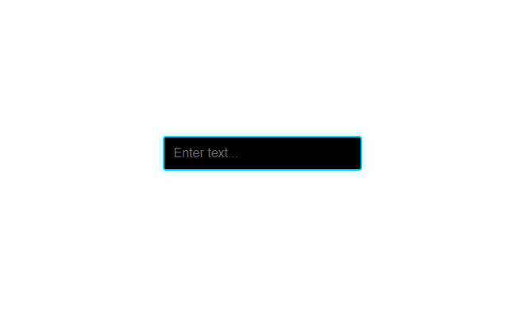

**Input with clear button functionality:**
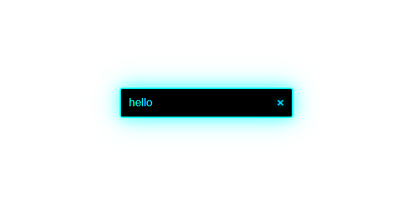

**Password input with visibility toggle:**


**Password input with both toggle and clear button:**
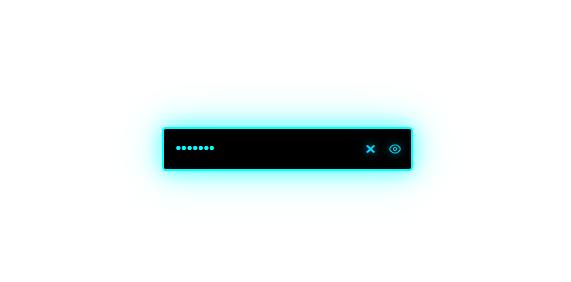

**Number input type:**
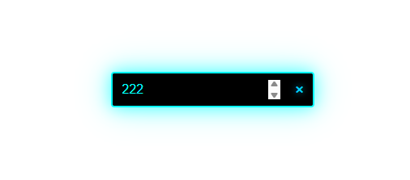

**Email input type:**
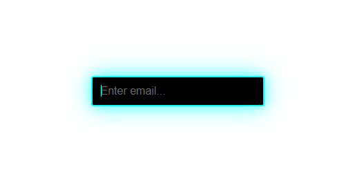

**Disabled input state:**
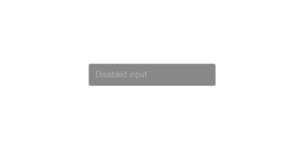

**Controlled input with state management:**
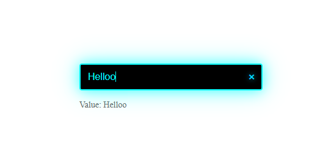

### Toast Component

**Success toast notification:**
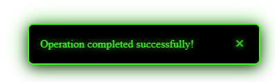

**Error toast notification:**
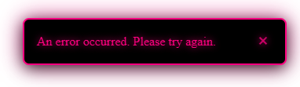

**Warning toast notification:**
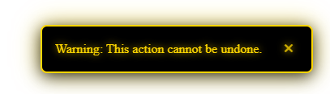

**Info toast notification:**
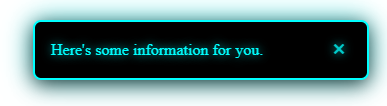

**Multiple toast notifications stacked:**
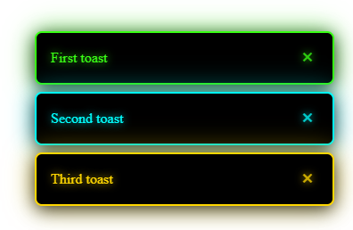

**Toast without manual close button:**
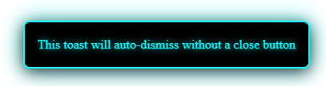

**Toast with long message text:**
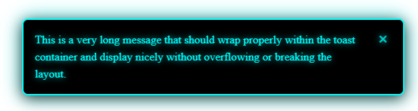

### Sidebar Menu Component

**Simple sidebar menu with single-level items:**
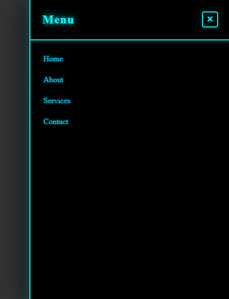

**Sidebar menu with one level of nesting:**
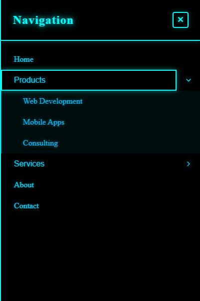

**Sidebar menu with two levels of nesting:**
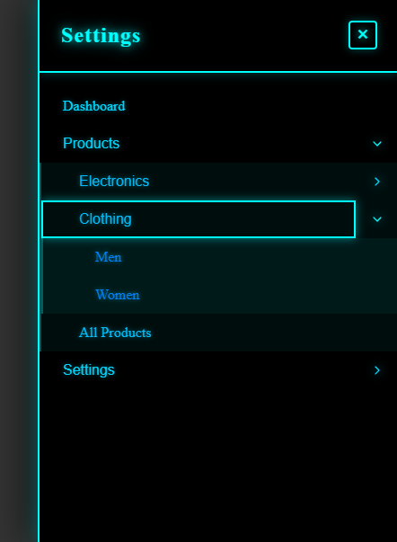

## Getting Started

1. Clone the repository
2. Install dependencies: `npm install`
3. Run Storybook: `npm run storybook`
4. View components at `http://localhost:6006`

## License

This project is private and for assessment purposes only.

## Author

Created as part of a front-end JS engineer test assessment.
